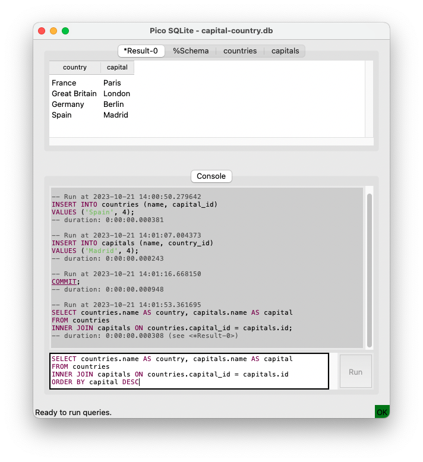

Pico SQLite
------------

A very tiny (pico?) sqlite viewer designed for educational
purpose.

The sqlite3 command-line interface is too low-level for beginners
whereas most viewers available are too features full and may be
confusing for newcomers.

Pico SQLite is a Tk-based command-line interface with a table, schema,
and query result viewer.

# Features
- Minimal Tk-based GUI
- Only depends on Python 3.7+
- Schema and table viewer with support for large tables thanks to rows
  lazy loading.
- Query runner and result viewer
- Script runner
- Syntax highlighting
- Active transaction indicator

# Screenshot

# Installation

Pico SQLite is a single standalone Python script that you can download
here:
- [latest](https://github.com/nicolasdespres/picosqlite/releases/download/v2.0.3/picosqlite.py)
- [1.0.1](https://github.com/nicolasdespres/picosqlite/releases/download/v1.0.1/picosqlite.py)

Once downloaded, copy (or symlink) it where you want and run it.

# License

*Pico SQLite* is released under the term of the
[Simplified BSD License](http://choosealicense.com/licenses/bsd-2-clause>).
Copyright (c) 2021-today, Nicolas Desprès
All rights reserved.
